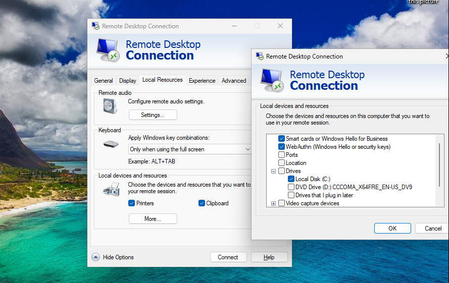

# RDP Exfil - The technique that works almost every time

<figure><figcaption>
An evil cat trying to exfiltrate data out of a secure network
</figcaption></figure>

Last week I got a call from one of my old Red Teamer friend. He was struggling to exfiltrate the data out of an Active Directory network. The proxy was setup to block almost all popular cloud services that could be used to exfiltrate the data.&#x20;

I asked him, why don't you use your C2 channel for exfiltration, it is surely the most obvious way, right? He had a valid concern of being burnt. Lucky for him, he had hands on keyboard access and this means that he can login into the target machine and perform actions via typing on the keyboard and leveraging the mouse. Learn more about [hands-on-keyboard activity](https://www.threatdown.com/blog/hands-on-keyboard-hok-attacks-how-ransomware-gangs-attack-in-real-time).)

I suggested a technique that I used multiple times back in the day, when I used to Red Team for my clients and that's "Exfiltration using Remote Desktop Protocol". A cool, slow and easy technique to exfiltrate data that's often underrated, overlooked and undetected (almost everywhere).


Interestingly, the situation he's in isn't a rare scenario. Often ransomware operators have hands on keyboard access. So this attack scenario is applicable for companies of all sizes (because Ransomware gangs don't discriminate :disappointed\_relieved:


## 🌬️ Using RDP for exfiltration of data

The attack in simple words is:&#x20;

* The attacker has hands on keyboard access to the victim's workstation/server.&#x20;
* The attacker creates a malicious Windows server/workstation on the cloud or hosts it anywhere where it is accessible to the victim machine. This can be typically achieved by creating a malicious Windows server on Public cloud environments.&#x20;
* The attacker connects to the malicious windows server using RDP protocol.
* By the very nature of RDP protocol, the attacker will be able to copy data out of the victim machine and safely disconnect.&#x20;
* The attacker connects to the malicious windows server from another location and copies the data into another infrastructure.

### 🚨Traditional copy and paste

A lot of you must already know how the attacks happen. It's a simple copy and paste of data into the specific server.

<figure><figcaption>
RDP copy and paste way to exfil data out of the network
</figcaption></figure>

### 🚨Drive mapping

When creating an RDP connection, using advanced settings, a user can map the drive on a local machine to a remote machine. This can be achieved by using the <kbd>Local Resources tab > More</kbd> on the Remote Desktop Connection dialog box.&#x20;

<figure><figcaption>
Mapping drives while connecting to malicious server
</figcaption></figure>

<figure><figcaption>
Dialog button while connecting to RDP when drives are shared
</figcaption></figure>

## 🥳 Monitoring/Detection Opportunities

* **Firewall**

Firewall is arguably one of the easiest ways of detecting this type of exfiltration. While my setup (pfSense) doesn't support streaming of traffic volume, a few handful of firewalls actually report this data and allow for identification of data exfiltration over RDP.&#x20;

<figure><figcaption>
Real-time monitoring of a pfSense firewall using Traffic Graphs
</figcaption></figure>

* **Endpoint Agents (XDR/EDR/Zeek, etc)**

During my assessments trying out with multiple popular EDR/XDR products, I have observed that none of these products currently are capable of detecting data exfiltration through this method. While it's possible to detect traffic volume anomaly using Zeek, unavailability of a stable Zeek release for Windows is a challenge.

While identifying traffic volume is a challenge, the instance of connecting to an RDP server itself can easily be detected. If you know a specific user isn't supposed to connect to a server over RDP, that's definitely suspicious.&#x20;

_**Sample detection scenarios:**_&#x20;

*   _User connects to an RDP server from a public cloud that's not typically associated with their usage pattern?_

    For instance, the user might connect &#x20;
*

## 🛣️ Final Thoughts

* This can be a very good tactic to bypass security controls
