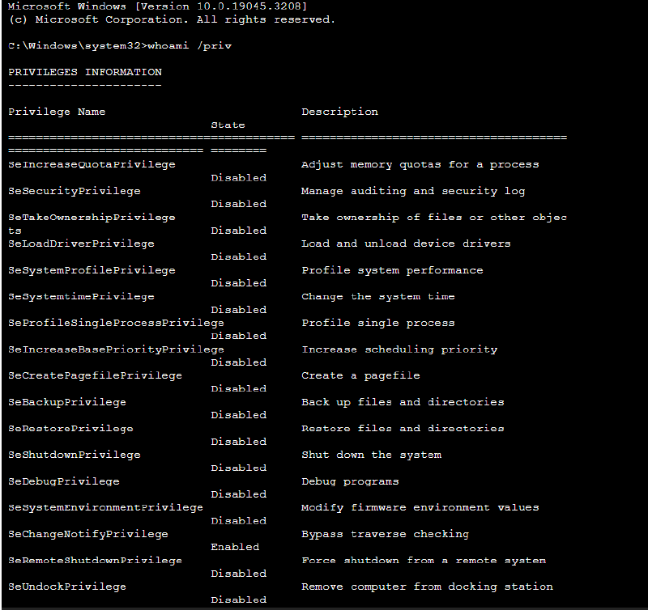
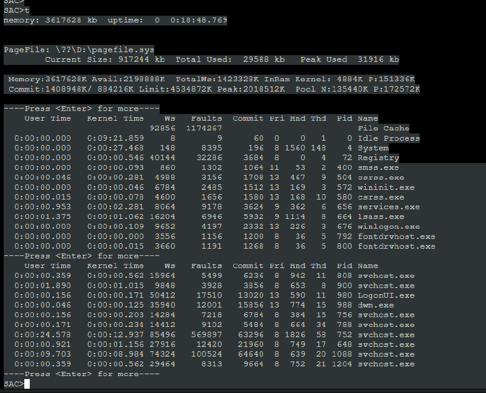
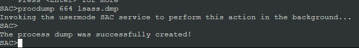
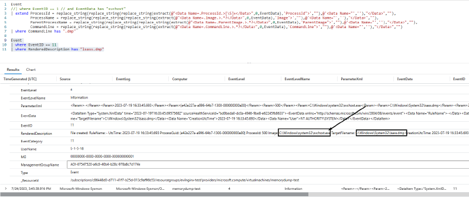

# Attack and Defend Azure Serial Console - Part 1

This blog was originally posted on Microsoft's MSRC blog on August 10, 2023, and this version is an archived/mirrored version. It was created in collaboration with Malla Reddy Donapati and Nutan Vishwakarma (MSRC Threat Hunting Team).

***

Ever had a virtual machine crash? Azure Serial console is a great way to directly connect to your Virtual machine and debug what went wrong. Azure Serial Console is a feature that’s available for free for everyone. While the primary intent of this feature is to assist users debug their machine, there are several interesting ways to abuse the features and compromise sensitive information. Let’s dive deep into the feature and explore various ways to exploit various features and ways to detect exploitation activity.

### Contents <a href="#contents" id="contents"></a>

* [What’s Azure Serial Console?](attack-and-defend-azure-serial-console-part-1.md#whats-azure-serial-console)
* [Why Azure Serial Console can be a good target for an adversary?](attack-and-defend-azure-serial-console-part-1.md#why-azure-serial-console-can-be-a-good-target-for-an-adversary)
* [Enable logging for user operation tracking​.](attack-and-defend-azure-serial-console-part-1.md#enable-logging-for-user-operation-tracking)
* [Different techniques to exploit features of Azure Serial Console](attack-and-defend-azure-serial-console-part-1.md#different-techniques-to-exploit-features-of-azure-serial-console)
* [Hunting for suspicious operations](attack-and-defend-azure-serial-console-part-1.md#hunting-for-suspicious-operations)
* [Best practices](attack-and-defend-azure-serial-console-part-1.md#best-practices)
* [Conclusion](attack-and-defend-azure-serial-console-part-1.md#conclusion)

### What’s Azure Serial Console? <a href="#whats-azure-serial-console" id="whats-azure-serial-console"></a>

Azure Serial Console connects to “ttyS0” or “COM1” serial ports of the Virtual Machine (VM) or Virtual Machine scale set (VMSS) instance and provide access independent of network or operating system state. It’s a text-based console for VM and VMSS on Azure that’s generally available for public, in all Azure regions (except Azure China Cloud) and is in public preview in Azure Government. [To know more](https://learn.microsoft.com/en-us/troubleshoot/azure/virtual-machines/serial-console-overview)

#### Pre-conditions to access Azure Serial Console: <a href="#pre-conditions-to-access-azure-serial-console" id="pre-conditions-to-access-azure-serial-console"></a>

* Boot diagnostics must be enabled for the VM (This can be enabled while creating a VM)
* An identity with at-least “Virtual Machine Contributor role”.
* Adversary is able to access [https://portal.azure.com](https://portal.azure.com/)
* Credentials to the VM/VMSS (for few attack scenarios, this is not required.)

### Why Azure Serial Console can be a good target for an adversary? <a href="#why-azure-serial-console-can-be-a-good-target-for-an-adversary" id="why-azure-serial-console-can-be-a-good-target-for-an-adversary"></a>

Azure Serial Console is very leveraged to circumvent security features and that’s precisely the reason why it’s a sweet target for Adversaries.

* Imagine a scenario where your Virtual machine is lockdown with RDP/SSH or other access has been disabled/restricted. This is typically the case for a lot of production grade setups where the authentication is locked down to specific IPs or subnets. Azure Serial Console isn’t bound by the NSG restrictions and can assist an attacker get CLI access to the machine.
* Microsoft Defender for Cloud offers [Just in time access (JIT)](https://learn.microsoft.com/en-us/azure/defender-for-cloud/just-in-time-access-usage), a great feature that allows admins to enable access only when access is needed, on the ports needed, and for the period of time needed. For VMs where JIT is enabled, Azure Serial Console can still be used to connect to VMs without having to request access through JIT.

### Enable logging for user operation tracking <a href="#enable-logging-for-user-operation-tracking" id="enable-logging-for-user-operation-tracking"></a>

There are several ways to stream logs and analyze but for the sake of this blog, we will be creating a log analytics workspace and stream logs to the created workspace. This would allow us to analyze the activity without owning a logging solution. However, this would differ according to your setup. If your setup has an SIEM, the schema, query language might be different.

#### Creation of Log Analytics Workspace [Creation of Log Analytics Workspace](broken-reference) <a href="#creation-of-log-analytics-workspace" id="creation-of-log-analytics-workspace"></a>

**Step-1:** Go to [Creation of Log Analytics Workspace on Azure Portal](https://portal.azure.com/#create/Microsoft.LogAnalyticsOMS), select the appropriate subscription, resource group and Name. Please note that Azure Monitor comes in 2 SKU’s. For more information about the pricing details on Azure Log Analytics, please [check here](https://azure.microsoft.com/en-in/pricing/details/monitor/).

[](<../../.gitbook/assets/creation of log analytics workspace\_hu937207b178f01c4abd0413255e0f6556\_66850\_0x800\_resize\_box\_3.png>)

#### Enabling Azure Activity Log monitoring <a href="#enabling-azure-activity-log-monitoring" id="enabling-azure-activity-log-monitoring"></a>

**Step-1:** Go to [Activity Log](https://portal.azure.com/#view/Microsoft\_Azure\_Monitoring/AzureMonitoringBrowseBlade/\~/activityLog), and click on “Export Activity Logs”.

[](<../../.gitbook/assets/go to activity log\_hue130d6f41f01fba36426c05659413b76\_98901\_800x0\_resize\_box\_3.png>)

**Step-2:** Click on “Add diagnostic setting” and select “Administrative” and “Security” Categories. Click on “Send to Log Analytics Workspace” and select the log analytics workspace that was created [here](broken-reference).

<figure><figcaption></figcaption></figure>

#### Enabling Windows Event Log monitoring <a href="#enabling-windows-event-log-monitoring" id="enabling-windows-event-log-monitoring"></a>

Please note that this might not be required depending on your current setup. Feel free to skip this step if your cloud compute workloads are already being monitored either with Microsoft Sentinel or another Security monitoring solution (such as SIEM).

**Step-1:** Install [Sysmon](https://learn.microsoft.com/en-us/sysinternals/downloads/sysmon) using the guide [here](https://learn.microsoft.com/en-us/sysinternals/downloads/sysmon#examples).

**Step-2:** Download Azure Monitor and Configure it. Go to Agents, download Windows Agent [64 Bit](https://go.microsoft.com/fwlink/?LinkId=828603) or [32 Bit](https://go.microsoft.com/fwlink/?LinkId=828604). Follow on-screen instructions and install the agent. Once the installation is complete, proceed to the next step.&#x20;

<figure><figcaption></figcaption></figure>

**Step-3:** Create a data collection rule. Go to [Creation Wizard](https://portal.azure.com/#view/HubsExtension/BrowseResource/resourceType/microsoft.insights%2Fdatacollectionrules) and fill in the name, resource group and location. Follow the instructions in the video below to complete the log configuration. Use the following XPath to backup “Sysmon” logs.

```
<QueryList>
    <Query Id="0" Path="Microsoft-Windows-Sysmon/Operational">
        <Select Path="Microsoft-Windows-Sysmon/Operational">*</Select>
    </Query>
</QueryList>
```

**Step-4:** Verify if the Azure activity logs and Windows Event Logs are properly received by using the following KQL queries. Go to the VM that you have created for testing and check the Logs section in the left side navigation bar

[](<../../.gitbook/assets/logs loc.png>)

* Check Azure Activity Logs

```
AzureActivity
| summarize count() by OperationNameValue
| count
```

* Check Windows Event Logs

If the output is anything greater than 0, it means you have successfully configured logging.

#### Different techniques to exploit features of Azure Serial Console <a href="#different-techniques-to-exploit-features-of-azure-serial-console" id="different-techniques-to-exploit-features-of-azure-serial-console"></a>

Please note that the following are limited to possibilities on a Windows Operating System.

**Execution of Command:**

Azure Serial console’s primary feature is to enable execution of commands. Provided that the attacker has credentials to the VM, an adversary can execute commands with root/admin privileges on a VM. This doesn’t provide a GUI access but the CLI access can be used to [execute commands](https://attack.mitre.org/techniques/T1059), [maintain persistance](https://attack.mitre.org/tactics/TA0003) and [move laterally](https://attack.mitre.org/tactics/TA0008) across the network. To execute commands on a VM using Azure serial console, the following steps can be followed.

1.  Go to Serial Console option on the left navigation bar and once the prompt loads, enter `cmd` to create a command prompt channel.


    <figure><figcaption></figcaption></figure>
2.  Enter `ch -sn Cmd0001` to switch to the channel’s context, press ENTER and then enter the credentials to login into the CLI of the VM.


    <figure><figcaption></figcaption></figure>

The same can be done using Az CLI. The command `az serial-console connect -n <VM_Name> -g <ResourceGroup_Name>` can be used to connect using Az CLI. [Know more](https://learn.microsoft.com/en-us/cli/azure/serial-console?view=azure-cli-latest)

<figure><figcaption></figcaption></figure>

**Tracing of User activity performed using Azure Serial Console:**&#x20;

Assuming that you have followed all the steps (Installing Sysmon, Configuring Windows Event logging), the following KQL query can be used to trace activities performed using Azure Serial Console. The logic that’s used for the query is gathering all the logon IDs from windows event ID: `4624` where the LogonProcess is `sacsess.exe` and identifying processes whose SubjectLogonId belongs to the list of Logon IDs gathered in previous step.

```
let PIDs = Event
| where EventID == 4624
| extend LoginProcessName = replace_string(extract(@"Process Name:[\t]+[\w|\\|:|.]+",0,RenderedDescription),"Process Name:","")
| where LoginProcessName has "sacsess.exe"
| extend LogonID = replace_string(extract(@"TargetLogonId.>[\w|\d]+",0,EventData),'TargetLogonId">',"")
| distinct LogonID;
Event
| where Source == "Microsoft-Windows-Sysmon" and EventID == 1
| extend LogonID = replace_string(extract(@"LogonId.>[\w|\d]+",0,EventData),'LogonId">',"")
| where LogonID in (PIDs)
```

Using, Azure Activity Logs, we can trace the connection attempts performed by an adversary:

```
AzureActivity
| where OperationNameValue =~ "MICROSOFT.SERIALCONSOLE/SERIALPORTS/CONNECT/ACTION"
| where ActivityStatusValue =~ "Success"
```

#### Dumping of a specific process <a href="#dumping-of-a-specific-process" id="dumping-of-a-specific-process"></a>

One of the most interesting attack vector that Azure serial console enables is dumping a process without any authentication. The following are the steps that can be followed to achieve the same.

1. Use `t` command to list of all the processes. Once you identify the process and identify the PID of the process that you want to dump.

<figure><figcaption></figcaption></figure>

2. Use the PID identified in the previous step and use the command `procdump <PID> <LOCATION_OF_THE_FILE>`. In the following example, we are dumping LSASS.exe’s process memory.

<figure><figcaption></figcaption></figure>

#### Tracing of dumping activity performed using Azure Serial Console: <a href="#tracing-of-dumping-activity-performed-using-azure-serial-console" id="tracing-of-dumping-activity-performed-using-azure-serial-console"></a>

For the process dumps that are created using this process, the following query can b used.

```
Event
| where EventID == 11
| where RenderedDescription has "lsass.dmp"
```

The query searches for the creation of the file `lsass.dmp` in the event logs related to File creation (Event ID: 11 generated by Sysmon).

<figure><figcaption></figcaption></figure>

Further analysis indicated that the dump file is created by `svchost.exe` \[Command Line of the file creation process: `C:\Windows\system32\svchost.exe -k netsvcs -p` ]whose parent process is `services.exe` and grandparent process is `wininit.exe`. This is interesting as there is no indication that this activity was performed using the serial console.

<figure><figcaption></figcaption></figure>

This activity is currently detected by Microsoft Defender for Endpoint. Further guidance on how to detect and prevent LSASS dumping is documented [here](https://www.microsoft.com/en-us/security/blog/2022/10/05/detecting-and-preventing-lsass-credential-dumping-attacks/).


The process tree evidence as seen in Defender for Endpoint is below:

[](<../../.gitbook/assets/lsass dmp defender 2\_hub24b52ee2f8c243f91185a845e808fbe\_34332\_800x0\_resize\_box\_3.png>)

The creation of the lsass dumping can be detected with the help of the below Yara rule.

```
rule creation_of_dmp {
    meta:
        author = "Subhash P <@pbssubhash>"
        filetype = "DUMP File"
        date = "1/1/2023"
        version = "1.0"
    strings:
        $md = { 4d 44 4d 50 }
        $a1 = "SeDebugPrivilege" fullword wide 
        $a2 = "\\pipe\\lsass" fullword wide
        $a3 = "lsasspirpc" fullword wide
    condition:
        ($md at 0) and all of ($a*)
}
```

#### Enumeration and other capabilities <a href="#enumeration-and-other-capabilities" id="enumeration-and-other-capabilities"></a>

Azure Serial Console offers few other capabilities in unauthenticated SAC console mode.Please note that the following is an exhaustive list of commands (other than procdump) that are available with SAC:

| Command              | Short Description                                                                                                 | Security Implication                                 |
| -------------------- | ----------------------------------------------------------------------------------------------------------------- | ---------------------------------------------------- |
| `ch`                 | Channel management commands                                                                                       | None                                                 |
| `cmd`                | Create a command prompt channel                                                                                   | Execute Commands on the VM                           |
| `d`                  | Dump the current kernel log                                                                                       | Aid an adversary in performing recon                 |
| `f`                  | Toggle detailed or abbreviated tlist info                                                                         | Aid an adversary in performing recon                 |
| `i`                  | List all IP network numbers and their IP addresses and set IP info                                                | Aid an adversary in performing recon                 |
| `id`                 | Display the computer identification information                                                                   | Aid an adversary in performing recon                 |
| `k <pid>`            | Kill the given process                                                                                            | Aid an adversary to cause Denial of Service          |
| `l <pid>`            | Lower the priority of a process to the lowest possible.                                                           | Aid an adversary to degrade performance of a service |
| `lock`               | Lock access to Command Prompt channels.                                                                           | Aid an adversary to cause Denial of Service          |
| `m <pid> <MB-allow>` | Limit the memory usage of a process to .                                                                          | Aid an adversary to degrade performance of a service |
| `p`                  | Toggle paging the display.                                                                                        | None                                                 |
| `r <pid>`            | Raise the priority of a process by one                                                                            | None                                                 |
| `s`                  | Display the current time and date (24 hour clock used).                                                           | None                                                 |
| `s mm/dd/yyyy hh:mm` | Set the current time and date (24 hour clock used).                                                               | Aid an adversary to cause Denial of service          |
| `t`                  | Display the task list.                                                                                            | Aid an adversary in performing recon                 |
| `restart`            | Restart the system immediately.                                                                                   | Aid an adversary to cause Denial of Service          |
| `shutdown`           | Shutdown the system immediately.                                                                                  | Aid an adversary to cause Denial of Service          |
| `crashdump`          | Crash the system. You must have crash dump enabled.                                                               | Aid an adversary to cause Denial of Service          |
| `livedump [-u] [-h]` | Create a live kernel dump. Optional arguments will include userspace (-u) and hypervisor (-h) memory in the dump. | Exfiltrate Secrets from the dump                     |

#### Tracing of the activity performed by an adversary: <a href="#tracing-of-the-activity-performed-by-an-adversary" id="tracing-of-the-activity-performed-by-an-adversary"></a>

The actions performed by an adversary using Azure Serial Console (inside the command line channel and otherwise) can be traced using Boot diagnostics logs. They can be viewed in the `Help` section in the left navigation bar. They can’t be exported or streamed to an external location.

<figure><figcaption></figcaption></figure>

<figure><figcaption></figcaption></figure>

The log itself enables an attacker to mint credentials and other secrets present in command line parameters for commands such as `net user <username> <password> /add`. As any command typed in, using Azure Serial Console is logged here, if an admin uses commands with secrets in command line, they can be extracted by an adversary. To identify if an adversary has visited Boot diagnostics, the following query can be used:

```
AzureActivity
| where OperationNameValue == "MICROSOFT.COMPUTE/VIRTUALMACHINES/RETRIEVEBOOTDIAGNOSTICSDATA/ACTION"
| where ActivityStatusValue == "Success"
```

### Hunting for suspicious operations <a href="#hunting-for-suspicious-operations" id="hunting-for-suspicious-operations"></a>

#### Suspicious Azure Serial Console Interactions in Azure Activity logs: <a href="#suspicious-azure-serial-console-interactions-in-azure-activity-logs" id="suspicious-azure-serial-console-interactions-in-azure-activity-logs"></a>

*   **Unusual IP or user interaction:** The following query identifies any Azure Serial console interaction done using an identity from an IP address that isn’t used in the last 30 days. While this is a very naive way of filtering, advanced techniques such as UEBA are available with [Azure Sentinel](https://learn.microsoft.com/en-us/azure/sentinel/identify-threats-with-entity-behavior-analytics).

    ```
    let 30DaysData = AzureActivity
    | where TimeGenerated >= ago(30d)
    | distinct Caller, CallerIpAddress;
    let Callers = 30DaysData | distinct Caller;
    let IPs = 30DaysData | distinct CallerIpAddress;
    AzureActivity
    | where TimeGenerated >= ago(1d)
    | where not(Caller has_any(Callers) and CallerIpAddress has_any(IPs))
    ```
*   **Failed access attempts:** The following query identifies failed attempts to access Azure Serial Console. This may be due to an adversary performing recon to identify if they have access to console.

    ```
    AzureActivity
    | where TimeGenerated >= ago(7d)
    | where OperationNameValue =~ "MICROSOFT.SERIALCONSOLE/SERIALPORTS/CONNECT/ACTION"
    | where ActivityStatusValue != "Success"
    ```
*   **Risky Signin with subsequent serial console action:** The following query identifies risky users accessing Azure Serial Console. Please note that logging has to be enabled by following [this guide.](https://github.com/MicrosoftDocs/azure-docs/blob/main/articles/active-directory/identity-protection/howto-export-risk-data.md). The following query can be used to get the list of risky users and check if the same IP that triggered Microsoft Identity security algorithms have been used to access serial console.

    ```
    let RiskyUsersData = AADUserRiskEvents
    |summarize by UserPrincipalName, IpAddress;
    let RiskyCallers = RiskyUsersData | distinct UserPrincipalName;
    let RiskyIPs = RiskyUsersData | distinct IpAddress;
    AzureActivity
    | where OperationNameValue == "MICROSOFT.SERIALCONSOLE/SERIALPORTS/CONNECT/ACTION"
    | where Caller has_any (RiskyCallers) and CallerIpAddress has_any (RiskyIPs)
    ```

#### Suspicious operations in Windows Event logs:  <a href="#suspicious-operations-in-windows-event-logs" id="suspicious-operations-in-windows-event-logs"></a>

*   **LOLBIN Execution through Azure Serial Console:** The following query extracts the list of LOLBINs from the lolbas API and with a bit of pre-processing, identifies processes created using Azure Serial console and checks if any binaries identified previously are present.

    ```
    let LolBins = externaldata(Name:string,Description:string,Author:string,Created:datetime , Commands: dynamic, FullPath:dynamic, Detection:dynamic)[
    "https://lolbas-project.github.io/api/lolbas.json"
    ] with(format="multijson");
    let ExecLols = LolBins 
    | mv-expand Commands
    | extend Category = Commands['Category']
    | distinct Name;
    let PIDs = Event
    | where EventID == 4624
    | extend LoginProcessName = replace_string(extract(@"Process Name:[\t]+[\w|\\|:|.]+",0,RenderedDescription),"Process Name:","")
    | where LoginProcessName has "sacsess.exe"
    | extend LogonID = replace_string(extract(@"TargetLogonId.>[\w|\d]+",0,EventData),'TargetLogonId">',"")
    | distinct LogonID;
    Event
    | where Source == "Microsoft-Windows-Sysmon" and EventID == 1
    | extend LogonID = replace_string(extract(@"LogonId.>[\w|\d]+",0,EventData),'LogonId">',"")
    | where LogonID in (PIDs)
    | where EventID == 1 // and EventData has "svchost"
    | extend ProcessId = replace_string(replace_string(replace_string(extract(@"<Data Name=.ProcessId.>[\S]+</Data>",0,EventData),'ProcessId">',""),@'<Data Name="',''),"</Data>",""),
            ProcessName = replace_string(replace_string(replace_string(extract(@"<Data Name=.Image.>.*?</Data>",0,EventData),'Image">',""),@'<Data Name="',''),"</Data>",""),
            ParentProcessName = replace_string(replace_string(replace_string(extract(@"<Data Name=.ParentImage.>.*?</Data>",0,EventData),'ParentImage">',""),@'<Data Name="',''),"</Data>",""),
            CommandLine = replace_string(replace_string(replace_string(extract(@"<Data Name=.CommandLine.>.*?</Data>",0,EventData),'CommandLine">',""),@'<Data Name="',''),"</Data>","")
    | extend ProcessName = split(ProcessName,@"\")[-1]
    | where ProcessName has_any(ExecLols)
    ```
*   **Powershell execution through Azure Serial Console:** The following query identifies processes that are created using Azure Serial console and have the keyword `powershell` in them.

    ```
    let PIDs = Event
    | where EventID == 4624
    | extend LoginProcessName = replace_string(extract(@"Process Name:[\t]+[\w|\\|:|.]+",0,RenderedDescription),"Process Name:","")
    | where LoginProcessName has "sacsess.exe"
    | extend LogonID = replace_string(extract(@"TargetLogonId.>[\w|\d]+",0,EventData),'TargetLogonId">',"")
    | distinct LogonID;
    Event
    | where Source == "Microsoft-Windows-Sysmon" and EventID == 1
    | extend LogonID = replace_string(extract(@"LogonId.>[\w|\d]+",0,EventData),'LogonId">',"")
    | where LogonID in (PIDs)
    | where EventID == 1 // and EventData has "svchost"
    | extend ProcessId = replace_string(replace_string(replace_string(extract(@"<Data Name=.ProcessId.>[\S]+</Data>",0,EventData),'ProcessId">',""),@'<Data Name="',''),"</Data>",""),
            ProcessName = replace_string(replace_string(replace_string(extract(@"<Data Name=.Image.>.*?</Data>",0,EventData),'Image">',""),@'<Data Name="',''),"</Data>",""),
            ParentProcessName = replace_string(replace_string(replace_string(extract(@"<Data Name=.ParentImage.>.*?</Data>",0,EventData),'ParentImage">',""),@'<Data Name="',''),"</Data>",""),
            CommandLine = replace_string(replace_string(replace_string(extract(@"<Data Name=.CommandLine.>.*?</Data>",0,EventData),'CommandLine">',""),@'<Data Name="',''),"</Data>","")
    | where CommandLine has "powershell"
    ```
*   **Network Connections through processes initiated through Azure Serial Console:** The following query identifies processes that are created using Azure Serial console and checks if there are any Sysmon Event ID: `3` events which are created when a network connection is initiated.

    ```
    let PIDs = Event
    | where EventID == 4624
    | extend LoginProcessName = replace_string(extract(@"Process Name:[\t]+[\w|\\|:|.]+",0,RenderedDescription),"Process Name:","")
    | where LoginProcessName has "sacsess.exe"
    | extend LogonID = replace_string(extract(@"TargetLogonId.>[\w|\d]+",0,EventData),'TargetLogonId">',"")
    | distinct LogonID;
    let ProcID =Event
    | where Source == "Microsoft-Windows-Sysmon" and EventID == 1
    | extend LogonID = replace_string(extract(@"LogonId.>[\w|\d]+",0,EventData),'LogonId">',"")
    | where LogonID in (PIDs)
    | where EventID == 1 
    | extend ProcessId = replace_string(replace_string(replace_string(extract(@"<Data Name=.ProcessId.>[\S]+</Data>",0,EventData),'ProcessId">',""),@'<Data Name="',''),"</Data>",""),
            ProcessName = replace_string(replace_string(replace_string(extract(@"<Data Name=.Image.>.*?</Data>",0,EventData),'Image">',""),@'<Data Name="',''),"</Data>",""),
            ParentProcessName = replace_string(replace_string(replace_string(extract(@"<Data Name=.ParentImage.>.*?</Data>",0,EventData),'ParentImage">',""),@'<Data Name="',''),"</Data>",""),
            CommandLine = replace_string(replace_string(replace_string(extract(@"<Data Name=.CommandLine.>.*?</Data>",0,EventData),'CommandLine">',""),@'<Data Name="',''),"</Data>","")
    | distinct ProcessId;
    Event
    | where EventID == 3
    | extend ProcessId = replace_string(replace_string(replace_string(extract(@"<Data Name=.ProcessId.>[\S]+</Data>",0,EventData),'ProcessId">',""),@'<Data Name="',''),"</Data>","")
    | where ProcessId has_any(ProcID)
    ```
* **Creation of Services using Azure Serial Console (using command line parameters):** The following query detects the usage of sc.exe to create services.

```
let PIDs = Event
| where EventID == 4624
| extend LoginProcessName = replace_string(extract(@"Process Name:[\t]+[\w|\\|:|.]+",0,RenderedDescription),"Process Name:","")
| where LoginProcessName has "sacsess.exe"
| extend LogonID = replace_string(extract(@"TargetLogonId.>[\w|\d]+",0,EventData),'TargetLogonId">',"")
| distinct LogonID;
Event
| where Source == "Microsoft-Windows-Sysmon" and EventID == 1
| extend LogonID = replace_string(extract(@"LogonId.>[\w|\d]+",0,EventData),'LogonId">',"")
| where LogonID in (PIDs)
| where EventID == 1 // and EventData has "svchost"
| extend ProcessId = replace_string(replace_string(replace_string(extract(@"<Data Name=.ProcessId.>[\S]+</Data>",0,EventData),'ProcessId">',""),@'<Data Name="',''),"</Data>",""),
         ProcessName = replace_string(replace_string(replace_string(extract(@"<Data Name=.Image.>.*?</Data>",0,EventData),'Image">',""),@'<Data Name="',''),"</Data>",""),
         ParentProcessName = replace_string(replace_string(replace_string(extract(@"<Data Name=.ParentImage.>.*?</Data>",0,EventData),'ParentImage">',""),@'<Data Name="',''),"</Data>",""),
         CommandLine = replace_string(replace_string(replace_string(extract(@"<Data Name=.CommandLine.>.*?</Data>",0,EventData),'CommandLine">',""),@'<Data Name="',''),"</Data>","")
| where CommandLine has "sc" 
```

### Best Practices: <a href="#best-practices" id="best-practices"></a>

The following is a non-exhaustive list of best practices that we recommend for keeping Azure Serial Console secure:

* Enforce usage of MFA for all the users with “Virtual machine contributor” access.
* Regularly audit for RBAC permissions of users to ensure that the list of privileged users it’s up-to-date.
* Perform regular monitoring of activity using Azure Serial console by leveraging Azure Activity and Host based logs.

### Conclusion <a href="#conclusion" id="conclusion"></a>

While Azure Serial Console is a really good feature that allows developers and administrators to troubleshoot during tough times, it can become a security liability if not monitored and locked down. In the next part, we intend to cover Azure Serial console attack and defend when using a Linux flavoured OS.
