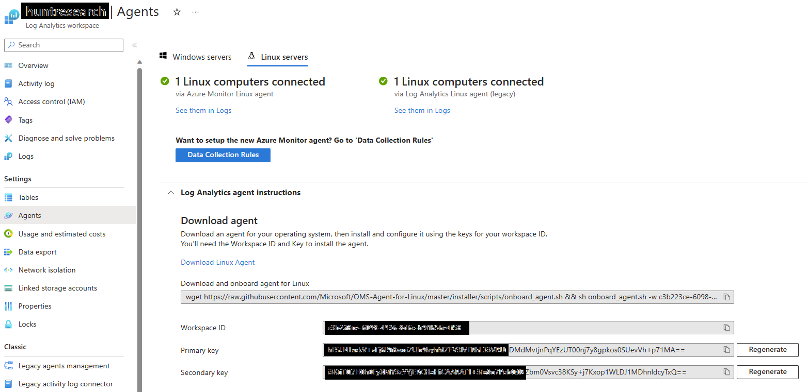
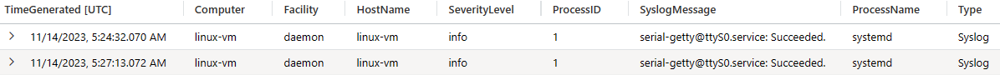
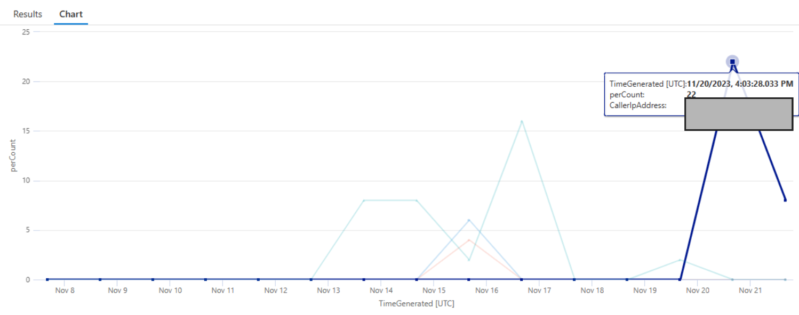
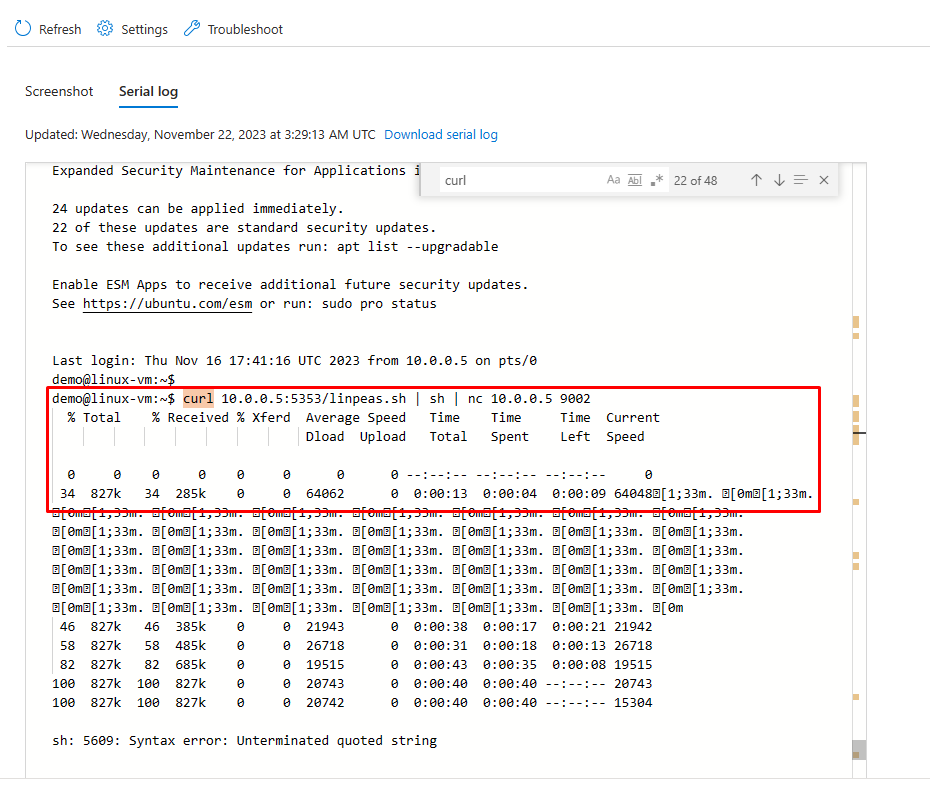

# Azure Serial Console Attack and Defense - Part 2

This blog was originally posted on Microsoft's MSRC blog on December 19, 2023, and this version is an archived/mirrored version. It was created in collaboration with Malla Reddy Donapati.

***

This is the second installment of the Azure Serial Console blog, which provides insights to improve defenders’ preparedness when investigating Azure Serial Console activity on Azure Linux virtual machines. While the first blog post discussed various tracing activities, such as using Azure activity and Sysmon logs on Windows virtual machines to trace serial console activity, this blog outlines how to enable logging for Azure Linux virtual machines using Sysmon for Linux to capture and how to send these events to a log analytics workspace. It also covers the tracing activity of serial console in Microsoft Defender for Endpoint logs. The goal extends beyond identifying serial console activity on Linux virtual machines, to using these artifacts to create additional hunting queries for detecting potential abuse by attackers.

### Contents

* [Enabling logging for Linux virtual machine](broken-reference)
* [Serial Console artifacts on Linux virtual machine](broken-reference)
* [Hunting for suspicious operations](broken-reference)
* [Best practices](broken-reference)
* [Conclusion](broken-reference)

### Enable logging for Linux Virtual machine

Please note that depending on your current setup, this step might not be necessary. If your cloud computing workloads are already monitored by Microsoft Sentinel or another security monitoring solution such as SIEM (security information and event management), feel free to skip this step. This section of the blog covers how to log Azure Linux virtual machine events using Sysmon for Linux and Microsoft Defender for Endpoint (for Linux) agents to capture the Azure serial console activity artifacts.

The creation of the log analytics workspace and enabling Azure activity monitoring is covered in [Part 1](https://msrc.microsoft.com/blog/2023/08/azure-serial-console-attack-and-defense-part-1/) of the blog. To enable logging for Linux virtual machine, install the Log Analytics Linux Agent as shown below from the Agents tab under Log Analytics workspace.

[](../../.gitbook/assets/0.png)

#### Syslog

Syslog is an event logging protocol commonly used in Linux. The Syslog daemon in Linux devices collects local events as specified and can send them to a Log Analytics workspace. Applications send messages that can be stored locally or sent to a Syslog collector. When the Azure Monitor agent for Linux is installed, it configures the local Syslog daemon to forward messages to the agent when Syslog collection is enabled in data collection rules (DCRs). The Azure Monitor Agent then transmits these messages to an Azure Monitor or Log Analytics workspace, creating corresponding Syslog records in a Syslog table. Collect Syslog events with Azure Monitor Agent using the guide [here](https://learn.microsoft.com/en-us/azure/azure-monitor/agents/data-collection-syslog#create-a-data-collection-rule).

#### Sysmon for Linux

Prerequisites to install Sysmon for Linux

* Ensure the Linux virtual machine is on boarded to Log analytics workspace.
* Collect Syslog events with Azure Monitor Agent using this [guide](https://learn.microsoft.com/en-us/azure/azure-monitor/agents/data-collection-syslog#create-a-data-collection-rule).

Install Sysmon using this [guide](https://github.com/Sysinternals/SysmonForLinux/blob/main/INSTALL.md) on Linux virtual machine. The configuration for Sysmon for linux can be found [here](https://gist.githubusercontent.com/Cyb3rWard0g/bcf1514cc340197f0076bf1da8954077/raw/293db31bb81c48ff18a591574a6f2bf946282602/SysmonForLinux-CollectAll-Config.xml) and install the Sysmon service with the below configuration.

```
<Sysmon schemaversion="4.70">
  <EventFiltering>
    <!-- Event ID 1 == ProcessCreate. Log all newly created processes -->
    <RuleGroup name="" groupRelation="or">
      <ProcessCreate onmatch="exclude"/>
    </RuleGroup>
    <!-- Event ID 3 == NetworkConnect Detected. Log all network connections -->
    <RuleGroup name="" groupRelation="or">
      <NetworkConnect onmatch="exclude"/>
    </RuleGroup>
    <!-- Event ID 5 == ProcessTerminate. Log all processes terminated -->
    <RuleGroup name="" groupRelation="or">
      <ProcessTerminate onmatch="exclude"/>
    </RuleGroup>
    <!-- Event ID 9 == RawAccessRead. Log all raw access read -->
    <RuleGroup name="" groupRelation="or">
      <RawAccessRead onmatch="exclude"/>
    </RuleGroup>
    <!-- Event ID 10 == ProcessAccess. Log all open process operations -->
    <RuleGroup name="" groupRelation="or">
      <ProcessAccess onmatch="exclude"/>
    </RuleGroup>
    <!-- Event ID 11 == FileCreate. Log every file creation -->
    <RuleGroup name="" groupRelation="or">
      <FileCreate onmatch="exclude"/>
    </RuleGroup>
    <!--Event ID 23 == FileDelete. Log all files being deleted -->
    <RuleGroup name="" groupRelation="or">
      <FileDelete onmatch="exclude"/>
    </RuleGroup>
  </EventFiltering>
</Sysmon>
```

[](<../../.gitbook/assets/7. SysmonForLinux\_Install\_Service\_with\_Config.png>)

### Serial Console artifacts on Linux virtual machine

The evidence of accessing a virtual machine using serial console can be found in native Syslog and Sysmon for Linux logs on virtual machine. The Serial console connection happens over `/dev/ttyS0` on Linux virtual machines.

#### Tracing activity using Syslog

Identify launching of serial console to access a Linux virtual machine, it will initiate connection on `ttyS0` and show an authentication prompt with username and password to login into the virtual machine. The following query can be used to identify the same.

```
Syslog
| where ProcessID == 1 
| where Facility == "daemon"
| where SyslogMessage has "Found device /dev/ttyS0"
```

[](<../../.gitbook/assets/1. SerialConsoleLuanch.png>)

To identify the start of a virtual ttyS0 terminal upon the `/dev/ttyS0` is enabled on Linux virtual machine, the following query can be used.

```
Syslog
| where ProcessID == "1"
| where Facility =~ "daemon"
| where SeverityLevel =~ "info"
| where SyslogMessage has "Started Serial Getty on ttyS0"
```

[](<../../.gitbook/assets/2. Started Serial Getty on ttyS0.png>)

Discover successful virtual machine access using Serial console in Syslog native logs.

```
Syslog
| where ProcessID == 1 
| where ProcessName =~ "systemd"
| where SyslogMessage has "serial-getty@ttyS0.service: Succeeded"
```

[](../../.gitbook/assets/3.Succeeded..png)

Find Failed login attempts to connect to virtual machine using Serial console. The number of failed attempts will also be captured in syslog logs for that corresponding user account for point of time.

```
Syslog
| where ProcessName =~ "login"
| where SyslogMessage has "FAILED LOGIN" and SyslogMessage has "/dev/ttyS0"  
```

[](<../../.gitbook/assets/4.Authentication failure.png>)

The use of ‘sudo’ after a successful authentication using serial console will be captured in syslog `authpriv` logs with the command being executed with ‘sudo’ and the commands with ‘sudo’ will also be captured.

```
Syslog
| where ProcessName =~ "sudo"
| where SyslogMessage has "TTY=ttyS0" and SyslogMessage has "USER=root"  
```

[](<../../.gitbook/assets/5. sudo.png>)

#### Tracing activity using Sysmon for Linux

Once Sysmon for Linux is successfully installed, the log analytics workspace begins to capture Sysmon events within syslog messages that contain “Linux-Sysmon.” The query below can be used to identify all process execution events on a Linux virtual machine accessed via the serial console. Sysmon for Linux logs all ProcessCreate events on the Linux virtual machine under Event ID 1.

This [Kusto](https://gist.githubusercontent.com/doreddy1/2d46a1e5644f047f7e8b4703c7c78a2d/raw/9ddb0988d78f629f441bdc2a9cc653c242619dce/SysmonForLinuxParser.kql) query can parse all Sysmon for Linux logs for all events mentioned in the current configuration file. This query can be saved as a function (for example, Sysmon\_for\_linux ) to search for different events on a Linux virtual machine using event ID field. Every process on a Linux virtual machine using the serial console has a unique parent process & command line. The parent process IDs will change depending on the serial console sessions. The parent process will be “/usr/bin/bash” and parent process commandline will be “-bash.” The Kusto query below can parse Sysmon for Linux logs for Event ID 1 (ProcessCreate) to identify the processes executed using serial console Special Administration Console (SAC). However, there is a caveat to this query as it only projects immediate child processes executed from the SAC console, not the processes spawned from a shell script.

```
Sysmon_for_Linux
| where EventID == 1 
| where ParentCommandLine == "-bash" or ParentCommandLine == "bash"
| extend ParentProcessId=tostring(ParentProcessId)
| join kind=inner (Sysmon_for_Linux
    | where EventID == 1
    | extend ProcessId=tostring(ProcessId)
    | where ParentImage has "/bin/login")
    on $left.ParentProcessId == $right.ProcessId 
| project
    UtcTime,
    Computer,
    User,
    CurrentDirectory,
    Image,
    CommandLine,
    ParentImage,
    ParentCommandLine,
    InitiatingProcessParentImage=ParentImage1,
    InitiatingProcessParentCommandLine=CommandLine1,
    LogonId,
    ProcessId,
    ParentProcessId,
    InitiatingProcessParentId=ParentProcessId1
```

[](<../../.gitbook/assets/8.1 Sysmon\_ProcessCreate\_SerialConsole\_Commands.png>)

For example, the below query can identify all public network connections from the processes executed (within the context of the logged in user) on a virtual machine using serial console.

```
Sysmon_for_Linux 
| where EventID == 3 // Network Connect
| where not(ipv4_is_private(tostring(DestinationIp)))
| where not(User in~ ("omsagent", "syslog", "systemd-resolve"))
| where not(Image has_any ("/opt/microsoft/azuremonitoragent/", "/opt/microsoft/omsagent/"))
| where DestinationIp !in ("127.0.0.1")
| project
    UtcTime,
    EventID,
    Image,
    tostring(ProcessId),
    tostring(User),
    Computer,
    Protocol,
    SourceIp,
    DestinationIp,
    SourcePort,
    DestinationPort,
    Operation
| join kind=inner (
    Sysmon_for_Linux
    | where EventID == 1 //Process Create
    | where ParentCommandLine == "-bash" or ParentCommandLine == "bash"
    | extend ParentProcessId=tostring(ParentProcessId)
    | join kind=inner (Sysmon_for_Linux
        | where EventID == 1
        | extend ProcessId=tostring(ProcessId)
        | where ParentImage has "/bin/login")
        on $left.ParentProcessId == $right.ProcessId 
    | project
        UtcTime,
        Computer,
        tostring(User),
        CurrentDirectory,
        Image,
        CommandLine,
        ParentImage,
        ParentCommandLine,
        InitiatingProcessParentImage=ParentImage1,
        InitiatingProcessParentCommandLine=CommandLine1,
        LogonId,
        tostring(ProcessId),
        ParentProcessId,
        InitiatingProcessParentId=ParentProcessId1)
    on ProcessId, User, Computer
| project UtcTime,Computer,User, Image, CommandLine,SourcePort,DestinationIp,DestinationPort 
```

[](<../../.gitbook/assets/9.1 Sysmon\_For\_Linux\_Network\_Connect\_EID\_3.png>)

#### Tracing activity using Microsoft Defender for Endpoint (MDE)

Microsoft Defender for Endpoint captures Azure serial console activity for a Linux virtual machine. This activity includes logging into virtual machines via the SAC console, executing all processes, and establishing network connections using the logged-in serial console. Serial console connections to the Linux virtual machine are established on virtual console terminals with device `/dev/vc/`. In general scenarios, direct serial console access to any device happens over `/dev/ttyS0`. The Kusto queries below for MDE will provide information related to logged-in users, executed processes, and established network connections using serial console.

The below Kusto query for MDE will identify logged in users using serial console

```
DeviceLogonEvents
| extend Terminal=tostring(parse_json(AdditionalFields).["Terminal"])
| where Terminal has "ttyS0" 
| project Timestamp, DeviceName,ActionType,LogonType,AccountDomain,AccountName,InitiatingProcessCommandLine, Terminal
```

[](../../.gitbook/assets/me\_sac\_logonEvents.png)

The Kusto query below identifies all processes executed during the session connected via the serial console.

```
DeviceProcessEvents
| extend InitiatingProcessPosixAttachedTerminal=tostring(parse_json(AdditionalFields).InitiatingProcessPosixAttachedTerminal)
| where InitiatingProcessPosixAttachedTerminal != ""
| where InitiatingProcessPosixAttachedTerminal has "/dev/vc/" //virtual console devices for Serial Console 
| project Timestamp,DeviceName,FileName,ProcessCommandLine,InitiatingProcessFileName,InitiatingProcessCommandLine,AccountName,InitiatingProcessPosixAttachedTerminal
| sort by Timestamp desc 
```

[](../../.gitbook/assets/mde\_sac\_processs2.png)

The Kusto query below will identify all network connections from the processes executed using serial console.

```
DeviceNetworkEvents
| extend InitiatingProcessPosixAttachedTerminal=tostring(parse_json(AdditionalFields).InitiatingProcessPosixAttachedTerminal)
| where InitiatingProcessPosixAttachedTerminal has "/dev/vc/" //virtual console devices for Serial Console 
| project Timestamp,DeviceName,ActionType,RemoteIP,RemoteIPType,InitiatingProcessCommandLine, InitiatingProcessAccountName,InitiatingProcessPosixAttachedTerminal
```

[](../../.gitbook/assets/mde\_sac\_network.png)

### Hunting for suspicious operations

The following are a few examples by using which a defender can detect suspicious activity around Azure serial console.

#### Hunting suspicious operations using Sysmon for Linux event logs

An attacker can gain initial access through the Azure serial console, and any activity following this access can be identified using the serial console spawned process lineage. While there are multiple KQL (Kusto Query Language) hunting queries available to detect suspicious operations on Linux virtual machine, the below Kusto query can be particularly useful for hunting the most common techniques. Note that the below query does not cover all Linux attack techniques. However, it presents the process hierarchy that can be leveraged by security analysts to identify activity done through serial console on a linux machine.

```
Sysmon_for_Linux
| where EventID == 1 
| where ParentCommandLine == "-bash" or ParentCommandLine == "bash"
| extend ParentProcessId=tostring(ParentProcessId)
| join kind=inner (Sysmon_for_Linux
    | where EventID == 1
    | extend ProcessId=tostring(ProcessId)
    | where ParentImage has "/bin/login")
    on $left.ParentProcessId == $right.ProcessId 
| where Image has_any ("ssh", "netcat", "telnet", "rsh", "rcp", "rsync", "ftp", "smbclient", "smbmount", "smbget", "curl", "wget", "/nc", "ncat", "socat", "chisel", "pivoting", "proxy", "tunneling", "forwarding", "sshuttle", "htran", "iodine", "dnscat2", "dnscat3", "ptunnel", "udptunnel", "httptunnel", "proxytunnel", "stunnel", "sslh", "sslwrap", "proxychains")
    or Image has_any ("whoami", "history", "uname", "/ps", "passwd", "groups", "smbclient", "systemctl", "ifconfig", "/id", "ping", "traceroute", "whois", "nslookup", "dig", "host", "useradd")
    or Image has_any ("/var/tmp/")
    or CommandLine has_any ("dpkg -i", "dpkg-deb", ".deb")
    or (Image has "atd" and CommandLine has "atd")
    or (Image has "cron" and CommandLine has "cron")
    or (Image has "find" and CommandLine has "-perm")
    or (CommandLine has_any("chmod", "chown", "chattr"))
    or CommandLine has_any ("stop", "disable", "off", "pkill", "kill", "killall")
    or (Image has "find" and (CommandLine has_any ("password", "login", "token", "key")))
    or (Image has "find" and (CommandLine has_any ("pem", "pfx", "pgp", "gpg", "ppk", "p12", "cer", "p7b", "asc")))
| project
    UtcTime,
    Computer,
    User,
    CurrentDirectory,
    Image,
    CommandLine,
    ParentImage,
    ParentCommandLine,
    InitiatingProcessParentImage=ParentImage1,
    InitiatingProcessParentCommandLine=CommandLine1,
    LogonId,
    ProcessId,
    ParentProcessId,
    InitiatingProcessParentId=ParentProcessId1
```

#### Hunting suspicious operations using Microsoft Defender for Endpoint

Access to the serial console can be exploited to misuse known native system images to perform reconnaissance, download files, search for secrets, and perform lateral movement. The below query will find the execution of those most frequently used native images using serial console

```
let PotentialAbusedImages = pack_array("ssh", "netcat", "telnet", "rsh", "rcp", "rsync", "ftp", "smbclient", "smbmount", "smbget", "curl", "wget", "nc", "ncat", "socat", "chisel", "pivoting", "proxy", "tunneling", "forwarding", "sshuttle", "htran", "iodine", "dnscat2", "dnscat3", "ptunnel", "udptunnel", "httptunnel", "proxytunnel", "stunnel", "sslh", "sslwrap", "proxychains", "whoami", "history", "uname", "ps", "passwd", "groups", "smbclient", "systemctl", "ifconfig", "/id", "ping", "traceroute", "whois", "nslookup", "dig", "host", "useradd", "chmod", "chown", "chattr", "atd", "cron", "pkill", "kill", "killall");
DeviceProcessEvents
| extend InitiatingProcessPosixAttachedTerminal=tostring(parse_json(AdditionalFields).InitiatingProcessPosixAttachedTerminal)
| where InitiatingProcessPosixAttachedTerminal != ""
| where InitiatingProcessPosixAttachedTerminal has "/dev/vc/" //virtual console devices for Serial Console 
| where InitiatingProcessCommandLine has "bash"
| where FileName has_any (PotentialAbusedImages)
| project Timestamp,DeviceName,FileName,ProcessCommandLine,InitiatingProcessFileName,InitiatingProcessCommandLine,AccountName,InitiatingProcessPosixAttachedTerminal
```

#### Hunting suspicious operations using Azure Activity logs

In addition to the hunting techniques mentioned in [Part 1](https://msrc.microsoft.com/blog/2023/08/azure-serial-console-attack-and-defense-part-1/#suspicious-azure-serial-console-interactions-in-azure-activity-logs), anomalous serial console connect activity can be identified using the following query.

```
AzureActivity
| where OperationNameValue == "MICROSOFT.SERIALCONSOLE/SERIALPORTS/CONNECT/ACTION"
| make-series perCount=count() on TimeGenerated from ago(15d) to now() step 1d by CallerIpAddress, Caller
| render timechart 
```

[](../../.gitbook/assets/azana.png)

#### Hunting suspicious operations using Boot diagnostics logs

In [Part 1](https://msrc.microsoft.com/blog/2023/08/azure-serial-console-attack-and-defense-part-1/), we discussed how an adversary can abuse boot diagnostics logs for exfiltrating sensitive information. However, boot diagnostics logs remain a valuable source of activity identification. In instances where the logs such as Syslog are not backed up to a central location such as SIEM, boot diagnostics logs can provide crucial insights. These logs are not backed up to a SIEM due to the sensitive nature of data they might contain. However, they hold significant forensic value in cases where the logs are absent.

The following is an execution of LinPEAS (a popular privilege escalation tool) and reverse shell connectivity using Netcat. \[_Please note that Microsoft doesn’t endorse the usage of these tools and it’s the responsibility of readers to use these tools responsibly and ethically. Please check our_ [_terms of service_](https://azure.microsoft.com/en-us/support/legal/) _before using these tools against Azure or other Microsoft infrastructure._]

[](../../.gitbook/assets/bootdiag.png)

### Best Practices

The following is a non-exhaustive list of best practices that we recommend for keeping Azure Serial Console secure:

* Enforce usage of MFA (multifactor authentication) for all the users with “Virtual machine contributor” access.
* Regularly audit RBAC (role-based access control) permissions of users to ensure that the list of privileged users is up to date.
* Implement continuous monitoring of the Serial Console activities for Azure virtual machines using cloud native SIEM (such as Microsoft Sentinel). Set up alerts for suspicious activities.
* Establish clear and documented procedures for emergency access to the Serial Console. Ensure that these procedures are known to authorized personnel and are followed strictly in emergency scenarios.

### Conclusion

While Azure Serial Console is a beneficial feature that allows developers and administrators to troubleshoot during challenging times, it can become a security liability if not properly monitored and secured. This blog highlighted several opportunities for detecting malicious activity pertaining to Azure serial console. With logging opportunities, detection ideas and hunting queries discussed in the article, protecting Azure Serial console just got easy!

### References

* [Collect Syslog events with Azure Monitor Agent](https://learn.microsoft.com/en-us/azure/azure-monitor/agents/data-collection-syslog#create-a-data-collection-rule)
* [SysmonForLinux](https://github.com/Sysinternals/SysmonForLinux/blob/main/INSTALL.md)
* [Sysmon for Linux Configuration file](https://gist.githubusercontent.com/Cyb3rWard0g/bcf1514cc340197f0076bf1da8954077/raw/293db31bb81c48ff18a591574a6f2bf946282602/SysmonForLinux-CollectAll-Config.xml)
* [Sysmon for Linux Kusto query parser](https://gist.githubusercontent.com/doreddy1/2d46a1e5644f047f7e8b4703c7c78a2d/raw/9ddb0988d78f629f441bdc2a9cc653c242619dce/SysmonForLinuxParser.kql)
* [Deploy Microsoft Defender for Endpoint on Linux manually](https://learn.microsoft.com/en-us/microsoft-365/security/defender-endpoint/linux-install-manually?view=o365-worldwide)
