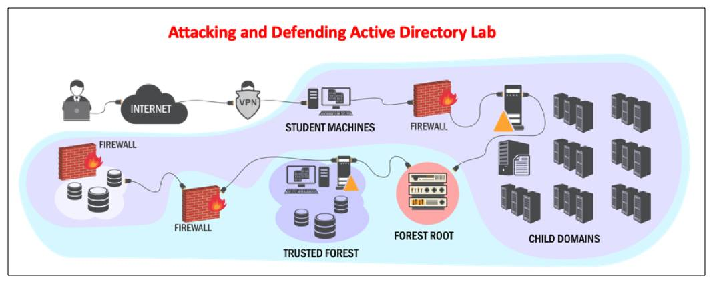
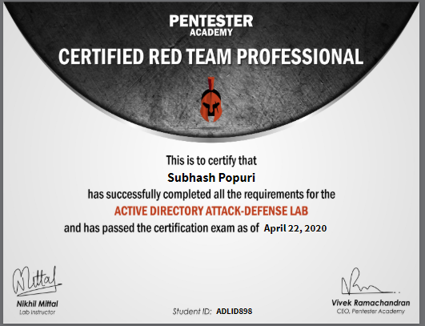

# Review of CRTP - Pentester Academy

Hello Everyone. Recently I completed Attacking and Defending Active Directory course offered by Pentester Academy. The following blog post is a simple review of the course.

### Q. What's CRTP?

CRTP is a certification offered by Pentester academy. It's given after clearing a 24-hour exam.&#x20;

At first, I was surprised to see a course taking the assume breach approach against a generic pentesting approach taken up by some other leading courses in the market (no pun intended!).&#x20;

**Q. What's Assume Breach methodology?**&#x20;

**A.** In Assume breach methodology we assume that the organisation is already breached. The whole objective of the machine is to test the resilience of the organisation against a threat actor who might've already compromised the organisation. This helps organisations to test their security team's capacity to identify and stop an attacker who might've already compromised their network.

## Course Overview

Once you subscribe to the course, you'd get access to the course videos and lab. As their [page ](https://www.pentesteracademy.com/activedirectorylab)suggests, the course consists of 23 learning objectives spanning across various stages of the cyber kill chain.&#x20;

#### Course Overview:&#x20;

The course videos were really crisp and beginner friendly. However, the course demands the student to know about basics of Active Directory. The Instructor [Nikhil Mittal](https://twitter.com/nikhil\_mitt) made it very clear that unlike OSCP, this course would be based on mis-configurations and abuse of functionality. This gives the attacks learned in the course more shelf time.

The Lab was really the best part of the course. It'd save a lot of headache of setting up an entire AD with various machines and roles. The team was also so supportive and replied whenever I had an issue in the lab. The tasks/objectives in the lab mainly revolve around the following:&#x20;

1. **Active Directory Enumeration**
2. **Local Privilege Escalation**
3. **Domain Privilege Escalation**
4. **Domain Persistence and Dominance**
5. **Cross Trust Attacks**
6. **Forest Persistence and Dominance**
7. **Defenses – Monitoring**
8. **Defenses and bypass – Architecture and Work Culture Changes**
9. **Defenses and Bypass – Deception**
10. **Defenses and Bypass – PowerShell**

**Exam:**

The exam is a separate forest and it's an open secret that you would have to compromise 5 machines. The team makes it very clear about the objective being the command execution on those 5 machines. The team also makes it very clear that reporting plays an important role in the exam and a bad report with 5 machines compromised might lead to the student fail in the exam. However, I came to know from friends who gave the exam that a minimum of 3 machines have to be compromised and along with a great report (adding possible mitigations') will just suffice.

**First Attempt:** I took the exam right after my 1 month lab period and I failed! Yes, I failed in my first attempt partially due to some tools not giving the right Output. This was made pretty clear by the Lab team well before the exam but I wasn't well prepared (bad me eh! :-( )

**Preparation:** I knew something was not right. Initially I decided to give up on the exam because I enrolled in the course for the content it provides and the lab's they've got. However, after closely looking at the dumps I had, I know I foolish I was to depend on an output of 1 tool and I understood the importance of re-validation. Another important lesson I learnt was about "Attacker Intuition" plays a major role. If you have the right mind, you'd get the attack path really fast. I thank [Anurag Srivastava](https://twitter.com/hexachordanu?lang=en) and [Bhanu Teja](https://twitter.com/bh4nut3j4) for throwing light on certain aspects of Attacker Intuition which really helped me think in the right direction.

**Second Attempt:** I got my hands on after couple of weeks of my first failed attempt and this time I cracked the exam within 4 hours and submitted report within the next 2. Got email from the team a day later. But the exciting part is that all critical systems falling one after another, just like in a Hollywood movie.

## Verdict

It's a great course. I recommend anyone who wants to get their hands-on on AD pentesting. Labs are great, Team is very supportive and Instructor was just awesome. As they claim, it's on holiday discount now. It's worth grabbing now. [Visit Pentester Academy - Attacking and Defending AD.](https://www.pentesteracademy.com/activedirectorylab)
