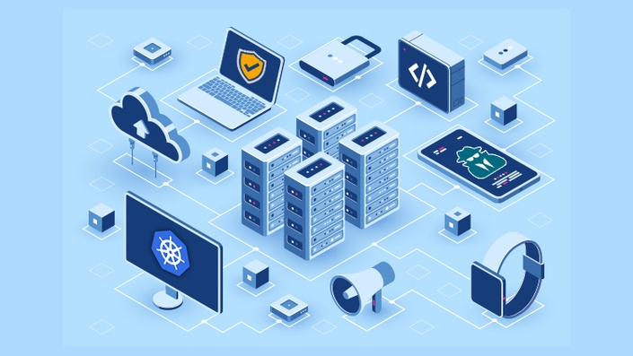

# Review of Hacking and Securing Kubernetes

I love learning new things and with great knowledge comes great responsibility to share the source of the knowledge. I recently came across a course called [**Hacking and Securing kubernetes**](https://theoffensivelabs.com/p/hacking-and-securing-kubernetes-clusters) and it instantly caught my eye as it was one of the few things that was on my long wish list to learn.&#x20;

> ## TLDR; If you're interested to register for the course, check this link.

### What's Kubernetes?

Kubernetes is a container orchestration platform that lets you maintain container based applications at scale. It was open-sourced by Google in early 2000's.

### Why should I care?&#x20;

Well, containers are taking over the application developments life cycle's by storm. I can probably take liberty to draw lines from the evolution of smartphones ruining pagers to the current container ecosystem overtaking the traditional development and deployment life-cycle.&#x20;

Kubernetes reduces cost and increases reliability, flexibility making it a great choice for teams and Security of the environment is of paramount importance as organisations are well aware about the optics of data leakage in the current arena.&#x20;

So if you're a pentester, it's important to understand the best practices to be followed in a containerized environment.&#x20;

### Intended Audience & Prerequisites?

You'd need to know the basics of containerization and basics of how web applications and routing works. This course is intended for&#x20;

* Developers who want to learn to secure their application environment
* Penetration testing teams who want to secure their organisation
* Security researchers and consultants who want to secure their clients

## Course content

The course content covers everything from basics of setting up a cluster setup to owning the underlying host to laterally moving and compromising master node. One of the best part of the course that fascinated me was the defenses section which had various mechanisms like using seccomp, apparmor, admission controllers and role based access controls (to name a few)..&#x20;

#### What was covered?

The following are the exhaustive list of topics that were covered as a part of the course.&#x20;

* Introduction to kubernetes&#x20;
* Common terms and tools of trade for controlling the setup
* Vulnerable application based lab setup and verification
* Attack surface of kubernetes
* Concepts of authentication, authorization, access control inside a cluster
* Penetration testing of a cluster setup
* Post exploitation and lateral movement techniques&#x20;
* Breaking out of a cluster to own the master node
* Various commonly-found mis-configurations in kubernetes setups
* Automated VAPT of clusters
* Various defenses to secure cluster against the bad guys.

## Review

### Pros

* The course content was really good. The trainer went straight to the point without discussing generic "Why information security" content (meh! I hate it when people do it all the time)
* The content was on-par with some reputed internal conference training's and the content was articulated well.
* Their support was really awesome. The team was always available through discord to support me through issues in setting up labs and other queries.
* Unlike other courses, defenses section for blue teams was also covered exhaustively.

### Cons&#x20;

* I wish there were hands-on labs associated with the course, I'd not hesitate to pay few extra bucks for that. However, the walk-through for the hands-on in the videos were quiet sufficient.

## Verdict

If you're looking to invest in learning, there's no better time. If you're interested to learn about Kuberenetes security, I'd suggest you to sign-up at https://theoffensivelabs.com. [Full Link](https://theoffensivelabs.com/p/hacking-and-securing-kubernetes-clusters). ( [https://theoffensivelabs.com/p/hacking-and-securing-kubernetes-clusters](https://theoffensivelabs.com/p/hacking-and-securing-kubernetes-clusters))

Disclaimer: I'm no where associated with the offensive labs. Don't direct your queries to me ;) You can ping them at [https://theoffensivelabs.com ](https://theoffensivelabs.com)
